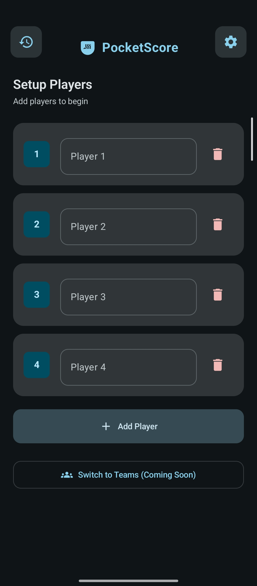
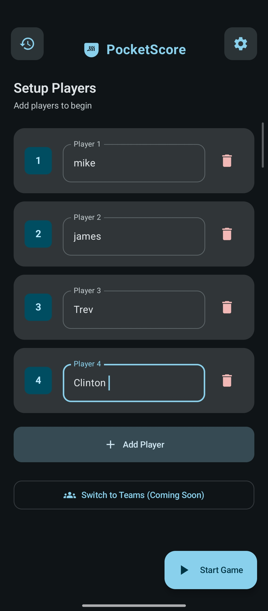
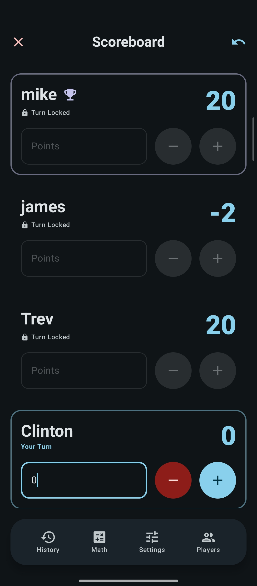
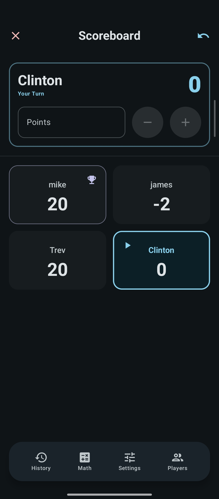
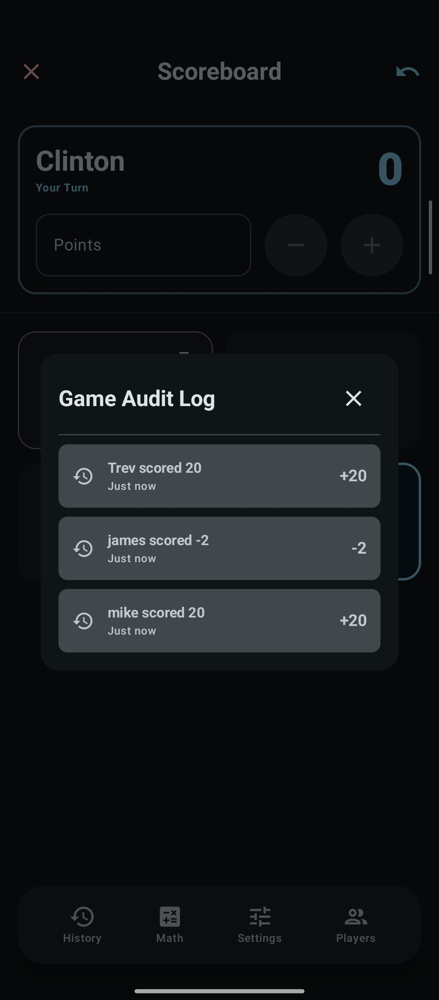
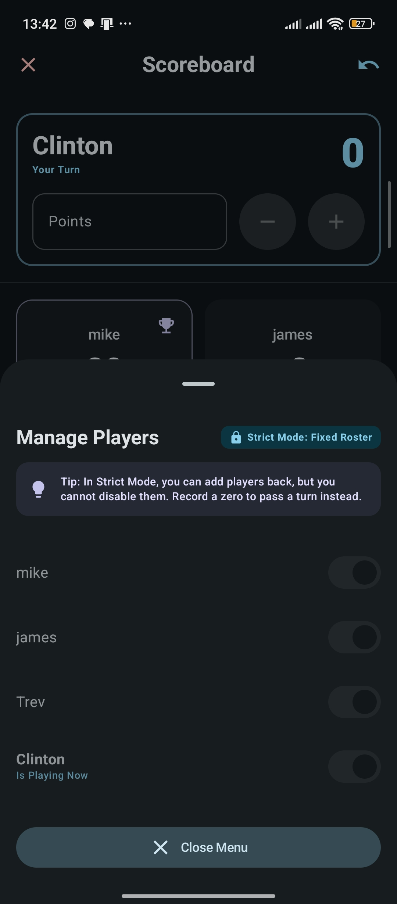
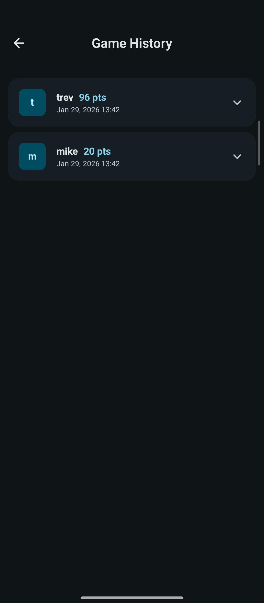
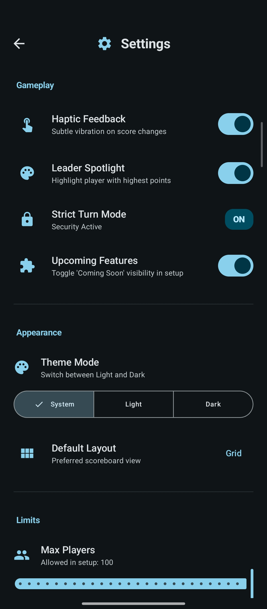

# PocketScore

PocketScore is a modern, expressive, and user-friendly score-keeping application for Android. Built with **Kotlin** and **Jetpack Compose**, it offers a seamless experience for managing game nights, tracking scores, and celebrating victories.

---

### 📥 [**Download Latest APK (v0.1.0)**](https://github.com/mwarrc/PocketScore/releases/download/v-0.1.0/PocketScore.apk)
*Quick and direct installation for Android.*

---


## Screenshots

<div align="center">
  
  
  
  
  <br>
  
  
  
  
</div>


## Features

*   **Game Management**: Easily set up new games, add players, and track scores in real-time.
*   **History Tracking**: Keep a record of all your past games. Never argue about who won last time again!
*   **Expressive UI**: Enjoy a beautiful, modern interface with fluid animations, including a confetti celebration for winners.
*   **Strict Mode**: Enforce strict turn-based rules for competitive consistency.
*   **Dark/Light Mode**: Fully supports system themes (and it looks great in both!).
*   **Local Persistence**: Your data is saved locally on your device using DataStore and managing JSON serialization.

## Tech Stack

*   **Language**: [Kotlin](https://kotlinlang.org/)
*   **UI Framework**: [Jetpack Compose](https://developer.android.com/jetpack/compose) (Material 3 Design System)
*   **Navigation**: [Compose Navigation](https://developer.android.com/guide/navigation/navigation-compose)
*   **Architecture**: MVVM (Model-View-ViewModel) with Clean Architecture principles (Core, Data, Domain, UI layers).
*   **State Management**: ViewModel & StateFlow.
*   **Persistence**: [DataStore](https://developer.android.com/topic/libraries/architecture/datastore) & [Kotlin Serialization](https://github.com/Kotlin/kotlinx.serialization).

## Project Structure

The project follows a feature-first modular structure:

```
com.mwarrc.pocketscore
├── core/           # Core utilities and extensions
├── data/           # Repositories and data sources
├── domain/         # Domain models (Game, Player, History)
└── ui/             # UI Layer
    ├── components/ # Reusable Compose components (Confetti, Cards)
    ├── feature/    # Feature-specific screens (Game, History, Settings)
    ├── theme/      # App theme and styling
    └── viewmodel/  # ViewModels
```

## Getting Started

### Prerequisites

*   Android Studio (Latest 2026 Stable Release).
*   JDK 17 or newer.

### Installation

1.  **Clone the repository**:
    ```bash
    git clone https://github.com/mwarrc/PocketScore.git
    cd PocketScore
    ```

2.  **Open in Android Studio**:
    *   Open Android Studio.
    *   Select "Open an existing Android Studio project" and navigate to the cloned directory.

3.  **Build and Run**:
    *   Wait for Gradle sync to complete.
    *   Select a connected device or emulator.
    *   Click the **Run** button (green arrow) or press `Shift + F10`.

## Contributing

Contributions are welcome! If you have suggestions or want to report a bug, please open an issue or submit a pull request.

1.  Fork the Project
2.  Create your Feature Branch (`git checkout -b feature/AmazingFeature`)
3.  Commit your Changes (`git commit -m 'Add some AmazingFeature'`)
4.  Push to the Branch (`git push origin feature/AmazingFeature`)
5.  Open a Pull Request

---

Built by https://github.com/mwarrc
